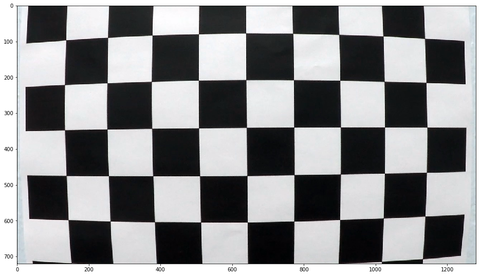
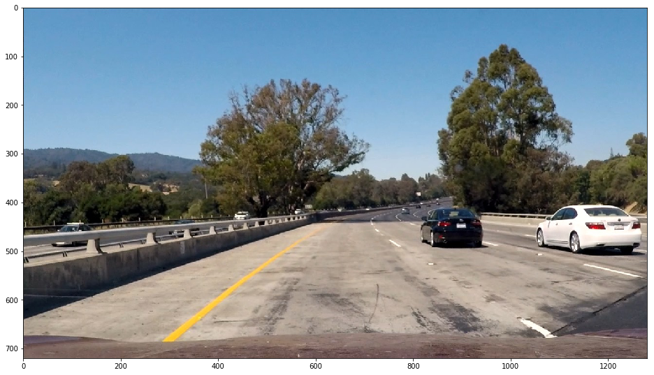
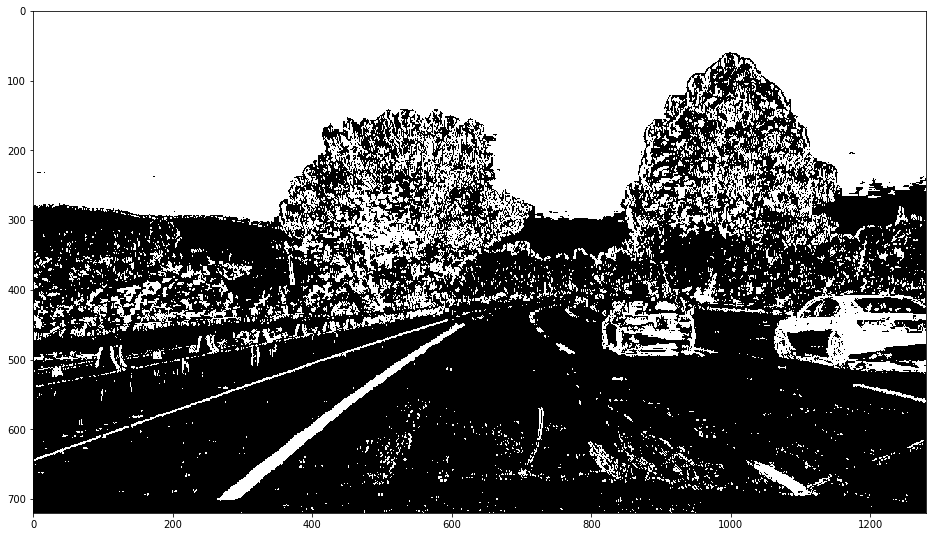
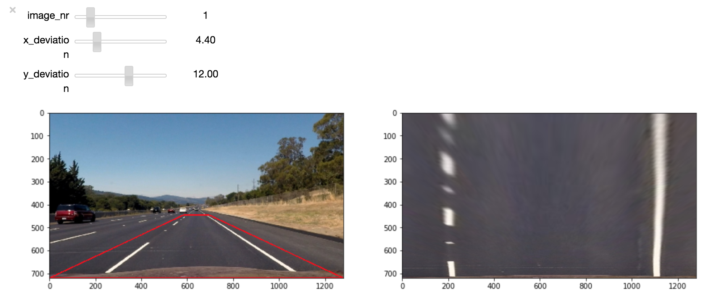
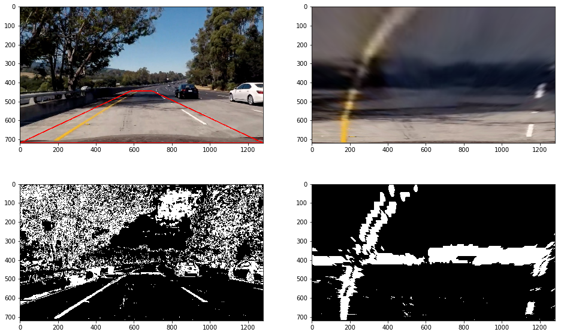
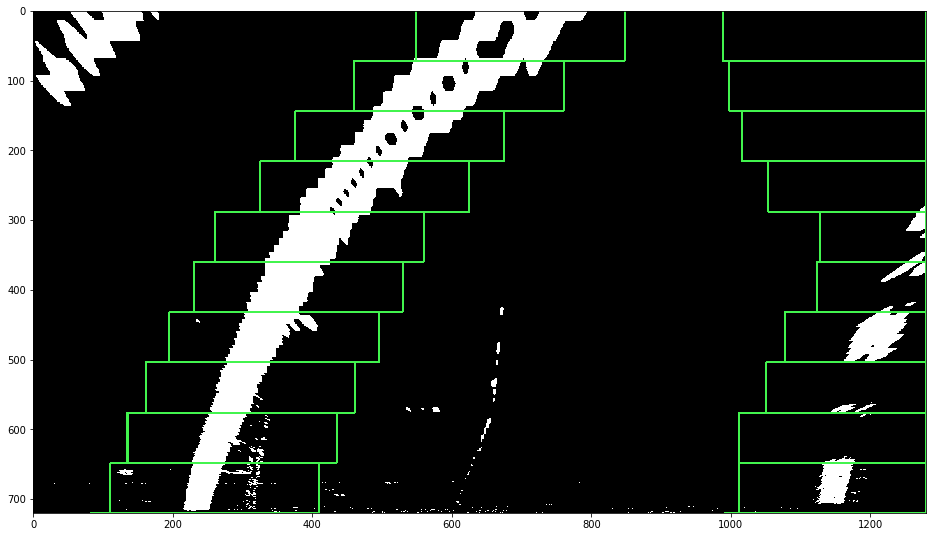

## Writeup Template

**Advanced Lane Finding Project**

The goals / steps of this project are the following:

* Compute the camera calibration matrix and distortion coefficients given a set of chessboard images.
* Apply a distortion correction to raw images.
* Use color transforms, gradients, etc., to create a thresholded binary image.
* Apply a perspective transform to rectify binary image ("birds-eye view").
* Detect lane pixels and fit to find the lane boundary.
* Determine the curvature of the lane and vehicle position with respect to center.
* Warp the detected lane boundaries back onto the original image.
* Output visual display of the lane boundaries and numerical estimation of lane curvature and vehicle position.

## [Rubric](https://review.udacity.com/#!/rubrics/571/view) Points

### Here I will consider the rubric points individually and describe how I addressed each point in my implementation.  

---

### Writeup

#### 1. Provide a Writeup that includes all the rubric points and how you addressed each one.   

You're reading it! If you want to see at the corresponding code take a look at the [Advanced Lane Finding.ipynb](./Advanced Lane Finding.ipynb). It is basically structured by following the same rubriks as this document.

### Camera Calibration

#### 1. Briefly state how you computed the camera matrix and distortion coefficients. Provide an example of a distortion corrected calibration image.

For the in depth theory behinde camera calibration check out [this description](https://docs.opencv.org/2.4/doc/tutorials/calib3d/camera_calibration/camera_calibration.html) by opencv.

To undistort an image the pixels of an image are multiplied with a transformation matrix. The transformation matrix is calculated by comparing photographs of a checkerboard with its theoretical flat representation. 

Here is a distorted image of a checkerboard.

And here it is undistorted.

### Pipeline (single images)

#### 1. Provide an example of a distortion-corrected image.

Here you can see the distorted and undistorted image from the camera in the car.

Distorted:

Undistorted:

The differences are subtle. But look at the car at the right edge of the image and you will see the differences.

#### 2. Describe how you used color transforms, gradients or other methods to create a thresholded binary image.  Provide an example of a binary image result.

In the notebook all filteres discussed in the course are implemented and you can experiment with them by using sliders provided with the interactive widgets. I think the sobel filter in x orientation and the stauration channel of the hls colorspace are most useful for this task. So I added up the binary outputs of these filters to create an image to find lane lines. 

The thresholds are:

- sobel in x orientation: all pixels above 15 are used to find lane lines.
- s channel: all pixels above 110 are used to find lane lines.

Image with sobel filter and saturation thresholding:

#### 3. Describe how you performed a perspective transform and provide an example of a transformed image.

The four points to apply a transformation are the bottem corners of the image and then two points which are moved some percent from the center of the image to the left and right and some percent to the bottom. To find which values for these percentages are good I used the ipython interactive widgets and sliders. I used an image with straight lines as a reference and moved the sliders to get prallel straight lines in the transformed image.

In the left image you can see a red rectangle. This is the rectangle used for the perspective transform to the right image.

Here is an example with a curve.

Here the warp and the filters are combined:

#### 4. Describe how you identified lane-line pixels and fit their positions with a polynomial?

As a first step a sliding window is extracted from the bottom of the filtered and transformed image. Then a histogramm is calculated which sums the number of white pixels for each column in the window.

The histogram gets split in half and the peaks in the histogram are used to calculate boxes in which lane lines are identified. These boxes have a width of 300 pixels and are 72 pixels high. The center of the box is at the peak of the histogram.

Then the boxes is moved from the bottom to the top of the image. A new histogram is calculated for each box and the box is repositioned at the peak of the histogram. 

Here you can see the boxes moving along the lane lines:

Then all white pixels in the left or right boxes are marked as left or right lane pixels. Their position in the image is used to fit a polynomial line.

The function for a polynomial line is:

x = f(y)

x = A * y**2 + B * y + C

The pixels are fitted and the function is solved for the A, B and C coefficient.

Here you can see in orange the pixels of the left lane and in blue the pixels of the right lane. Green are the boxes to search for lane pixels and in yellow are the fitted polynomial lines.

#### 5. Describe how you calculated the radius of curvature of the lane and the position of the vehicle with respect to center.

The curve is calculated at the same place where the lines are fitted in the `fit_lane` function . The formula to calculate the curve at any point y is as follows:

So I calculated the curve at the very bottom of the image (y = 720). 

#### 6. Provide an example image of your result plotted back down onto the road such that the lane area is identified clearly.

Here is an example of my result on a test image:

---

### Pipeline (video)

#### 1. Provide a link to your final video output.  Your pipeline should perform reasonably well on the entire project video (wobbly lines are ok but no catastrophic failures that would cause the car to drive off the road!).

I made two videos, one with smoothing of the lane coefficients enabled and one disabled. You can see that most of the failures get resolved by the smoothing.

At the bottom of the video you can see the filtered an transformed image, the sliding boxes to find the lines and the curvature and deviation from the line center.

Here's a [link to my video without smoothing](./video_out/project_video.mp4)

Here's a [link to my video with smoothing](./video_out/project_video_smooth.mp4)

---

### Discussion

#### 1. Briefly discuss any problems / issues you faced in your implementation of this project.  Where will your pipeline likely fail?  What could you do to make it more robust?

I don't really like the approach to set hardcoded thresholds to create a binary image. I think a lot of information is lost by that process. Also when the conditions of the image, like the brightness, changes the thresholds are most likely wrong and it results in failures. Also it is very time consuming to pick good thresholds. I definetly should have invested more time into that. But isn't parameter tuning something an optimizer should do? Therefore one has to come up with a clever way to calculate the error.

Also for steep curves the perspective transformation is not ideal, as the lane lines get out of the frame. This is already an issue with the lane lines in the project video.

I did not have enough time to experiment with the challenge videos, but I ran my pipeline on these videos and it doesn't work at all. I think the easy challenge needs other source points for the image transformation and a better system to discard wrong lane detections. Im also not sure if it is possible to solve the harder challenge with this approach at all.

Here's a [link to the challenge video](./video_out/challenge_video.mp4)

Here's a [link to the harder challenge video](./video_out/harder_challenge_video.mp4)

I would really like to experiment with deep concolutional networks to solve this problem. Then the whole image could be used to learn detecting lane lines without discarding any information contained in the original image. Also differences in brightness could automatically resolved by the network. Another [carnd student tried this](https://towardsdatascience.com/lane-detection-with-deep-learning-part-1-9e096f3320b7). He had to put a lot of time into that approach, as he had to generate its own training set but got pretty good results in the end.
